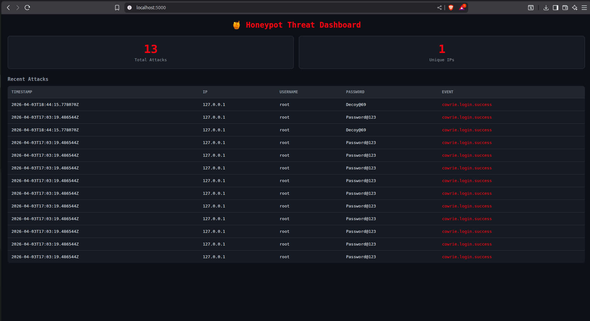
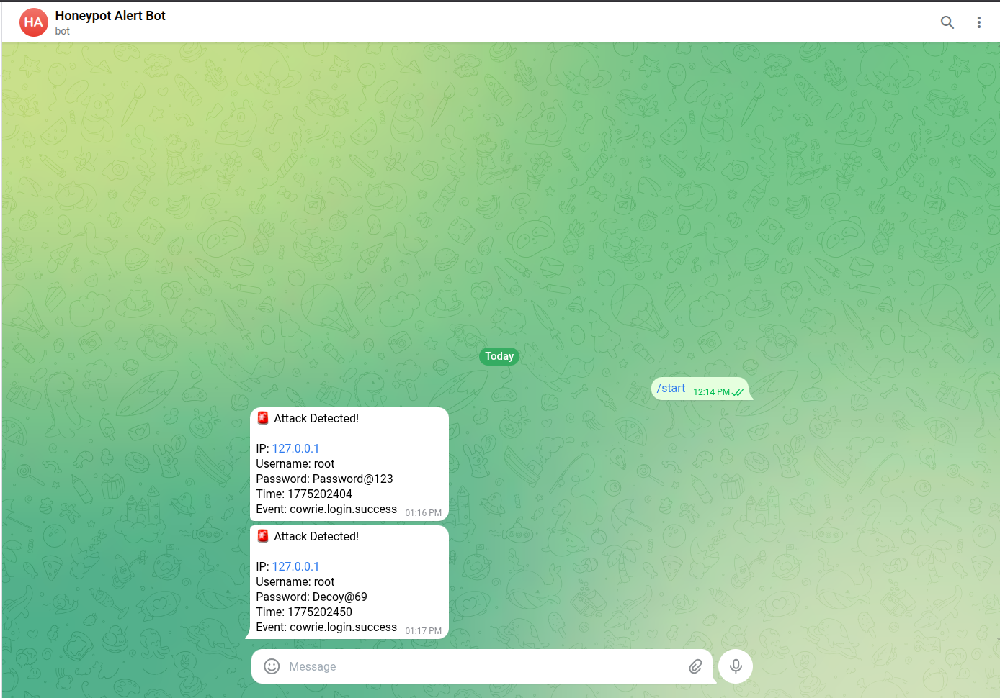
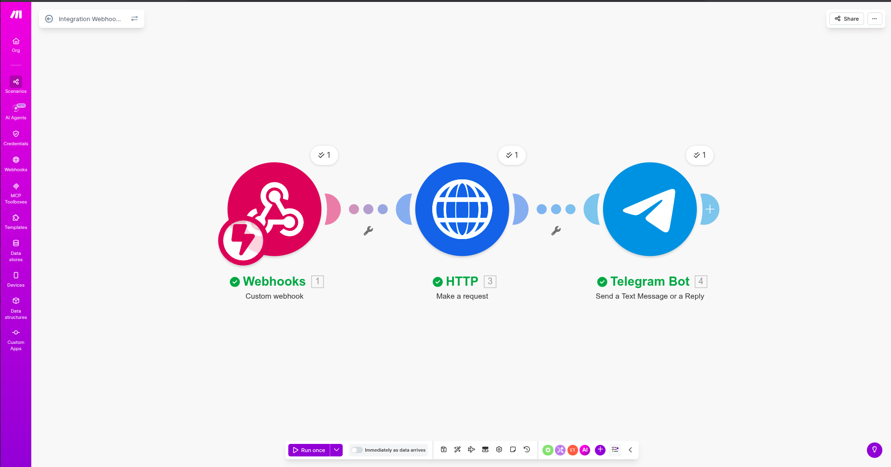
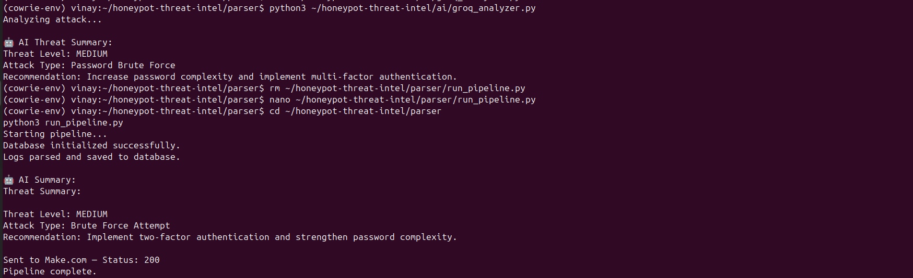

# 🍯 Honeypot Threat Intelligence Pipeline

> An automated, end-to-end SSH attack detection, analysis, and alerting system built entirely for free on a local Ubuntu machine.


---

## 📌 What Is This?

This project deploys a **Cowrie SSH honeypot** that lures attackers, captures every login attempt, command executed, and session detail — then automatically:

1. Parses the raw logs using Python
2. Stores structured attack data in SQLite
3. Triggers a **Make.com automation workflow**
4. Looks up the attacker IP on **AbuseIPDB**
5. Generates an **AI threat summary** using a local LLM (Ollama)
6. Sends a **Telegram alert** with full attack details
7. Displays everything on a **live Flask dashboard**

---

## 🖥️ Screenshots

### Live Attack Dashboard


### Telegram Real-Time Alert


### Make.com Automation Workflow


### AI Threat Analysis Output


---

## 🏗️ System Architecture

```
Attacker ──► Cowrie Honeypot (Port 2222)
                      │
                      ▼
              cowrie.json logs
                      │
                      ▼
         Python Log Parser (log_parser.py)
                      │
                      ▼
          SQLite Database (attacks.db)
               /              \
              ▼                ▼
   Make.com Webhook        Ollama AI (Local)
         │                     │
         ▼                     ▼
  AbuseIPDB Lookup       Threat Summary
         │
         ▼
  Telegram Alert ──► Flask Dashboard (localhost:5000)
```

---

## 📁 Project Structure

```
honeypot-threat-intel/
│
├── README.md
├── requirements.txt
├── .env.example
│
├── honeypot/
│   └── cowrie-config/          # Cowrie setup configs
│
├── parser/
│   ├── db_setup.py             # SQLite schema initialization
│   ├── log_parser.py           # Reads & parses Cowrie JSON logs
│   ├── webhook_trigger.py      # Sends attack data to Make.com
│   └── run_pipeline.py         # Master pipeline runner
│
├── automation/
│   └── make-workflows/         # Exported Make.com scenario JSONs
│
├── ai/
│   └── groq_analyzer.py        # Local Ollama AI threat analyzer
│
├── dashboard/
│   ├── app.py                  # Flask web application
│   └── templates/
│       └── index.html          # Live dashboard UI
│
├── screenshots/                # Project screenshots
└── data/
    └── attacks.db              # SQLite database (gitignored)
```

---

## ⚙️ Tech Stack

| Layer | Technology | Why |
|---|---|---|
| Honeypot | Cowrie | Industry-standard SSH honeypot with JSON logging |
| OS | Ubuntu Linux | Native Linux for best compatibility with security tools |
| Language | Python 3.12 | Best ecosystem for security scripting |
| Database | SQLite | Zero config, embedded, perfect for single-machine setup |
| Automation | Make.com | Visual workflow builder, free tier sufficient |
| Threat Intel | AbuseIPDB API | IP reputation scoring, 1000 free lookups/day |
| Alerting | Telegram Bot API | Free, instant, accessible on any device |
| AI | Ollama + dolphin-mistral:7b | 100% local inference, no API cost, no rate limits |
| Dashboard | Flask + Vanilla JS | Lightweight REST API with live-polling frontend |

---

## 🚀 Setup Guide

### Prerequisites
- Ubuntu Linux (dual-boot or VM)
- Python 3.10+
- Ollama installed with a local model
- Make.com account (free)
- Telegram account

### Step 1 — Clone the Repository
```bash
git clone https://github.com/baalajivinay/honeypot-threat-intel.git
cd honeypot-threat-intel
```

### Step 2 — Install Cowrie
```bash
cd cowrie
python3 -m venv cowrie-env
source cowrie-env/bin/activate
pip install -r requirements.txt
pip install -e .
cp etc/cowrie.cfg.dist etc/cowrie.cfg
cowrie start
```

### Step 3 — Set Up Environment Variables
```bash
cp .env.example .env
# Edit .env and fill in your API keys
```

### Step 4 — Initialize Database
```bash
cd parser
python3 db_setup.py
```

### Step 5 — Run the Pipeline
```bash
python3 run_pipeline.py
```

### Step 6 — Start the Dashboard
```bash
cd dashboard
python3 app.py
# Open http://localhost:5000
```

---

## 🔁 How the Pipeline Works

1. **Cowrie** listens on port 2222 and logs all SSH interactions to `cowrie.json`
2. **log_parser.py** reads new entries, filters login events, saves to SQLite
3. **groq_analyzer.py** sends the attack to local Ollama model for AI analysis
4. **webhook_trigger.py** POSTs the attack payload to Make.com webhook
5. **Make.com** calls AbuseIPDB API → sends Telegram alert
6. **Flask dashboard** polls SQLite every 5 seconds and updates the UI

---

## 🤖 AI Threat Analysis Sample

```
Threat Level: MEDIUM
Attack Type: Password Brute Force
Recommendation: Increase password complexity and
implement multi-factor authentication.
```

Powered by `dolphin-mistral:7b` running locally via Ollama — zero cloud dependency.

---

## 📊 What Gets Captured

Every SSH interaction is logged with:
- Source IP address
- Username attempted
- Password attempted
- Session ID
- Exact timestamp
- Event type (login.success / login.failed)
- Sensor hostname

---

## 🔐 Security Notes

- Never expose your real SSH port — Cowrie runs on 2222
- API keys are stored in `.env` (gitignored)
- The SQLite database is gitignored
- The honeypot runs as a non-root user

---

## 🗺️ Future Improvements

- [ ] Deploy on Oracle Cloud Free Tier for real internet traffic
- [ ] Add GeoIP world map to dashboard
- [ ] Auto-block IPs with iptables when threshold exceeded
- [ ] Detect attack campaigns across multiple sessions
- [ ] Add email digest of daily attack summary

---

## 👤 Author

**Vinaybaalaji P N S**
B.Tech Computer Science and Engineering (Cyber Security)
Amrita Vishwa Vidyapeetham, Coimbatore

[](https://github.com/baalajivinay)
[](https://linkedin.com/in/vinaybaalaji)

---

## 📄 License

MIT License — feel free to use, modify, and build on this project.
